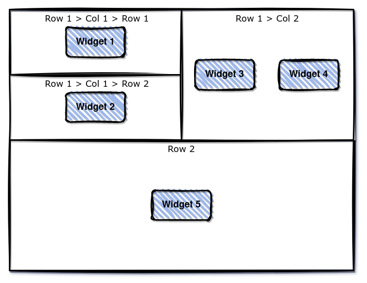

# Json Widgets Micro-Frontend

This is a Micro-Frontend written in Angular that can render a collection of configurable widgets in the UI. All the configuration are passed by a simple JSON string or JavaScript Object.

Being a Micro-Frontend, this can be used in any web-application be it Angular, React, Vue or even simple HTML + JS page.
An example of its use in a simple HTML page is given in the [demo](./demo/) folder.

### Usage

To use this Micro-Frontend, you need to first import its `main.js` and `style.css` files in your `index.html` file of the application where you want to render the widget collection. In case of non-Angular applications, you need to import the `polyfills.js` file as well.

```html
<link rel="stylesheet" href="http://localhost:4251/json-widgets-micro-frontend/styles.css" />
<script src="http://localhost:4251/json-widgets-micro-frontend/polyfills.js"></script>
<script src="http://localhost:4251/json-widgets-micro-frontend/main.js"></script>
```

Then use the HTML tag `json-widgets` with appropriate inputs and outputs to use this.

---

### Inputs & Outputs

| Key          | I/O    | Description                                                                                                                                                                             |
| ------------ | ------ | --------------------------------------------------------------------------------------------------------------------------------------------------------------------------------------- |
| jsonInput    | Input  | Expects a JSON string or JavaScript Object with the widget configuration and/or any network request parameters                                                                          |
| variables    | Input  | Expects a JS Object map of the variables and their values, that are automatically included in the variables of any `GRAPHQL` requests and are also available to be used in the widgets. |
| baseURL      | Input  | Expects a base URL string to be appended before the url in the requests mentioned in the `jsonInput`                                                                                    |
| tokens       | Input  | Expects a JS Object map of the tokens and their values, that can be used in the requests mentioned in the `jsonInput` for `Authorization` header.                                       |
| widgetOutput | Output | Some of the widgets can emit custom events through the `widgetOutput` event.                                                                                                            |

---

### JSON Input Structure

The JSON Input Structure consists of 2 parts: the requests part(`request`) and the widgets display configuration part (`rows`).

| Key                                          | Type                        | Description                                                                                                                                                                                                               |
| -------------------------------------------- | --------------------------- | ------------------------------------------------------------------------------------------------------------------------------------------------------------------------------------------------------------------------- |
| request                                      | Object / Object[]           | Contain the details of the requests that are to be made                                                                                                                                                                   |
| request.url / request[index].url             | String                      | Specifies the url of the API calls                                                                                                                                                                                        |
| request.method / request[index].method       | "GRAPHQL"\| "GET" \| "POST" | Specifies the method of the requests. Currently it supports GraphQl and REST (GET and POST) API calls                                                                                                                     |
| request.authToken / request[index].authToken | String                      | Specifies the `Authorization` header for each requests. It can either be directly set here or can take `${{tokenName}}` syntax where `tokenName` is the name of the token in the `tokens` object.                         |
| request.body / request[index].body           | Object / Object[]           | Contains the body of the GraphQL or REST (POST) API request. In case of`GraphQl` request, the `body.variables` or `body[index].variables` object will automatically also include `variables` passed to the Micro-Frontend |
| request                                      | Object / Object[]           | Contain the details of the requests that are to be made                                                                                                                                                                   |
| rows                                         | Object[]                    | This contains the widgets configuration. Each row can contain multiple widgets OR more rows or columns, which in turn can have multiple rows or columns.                                                                  |

- Each row or column can have `classes`, `widgets`, or more `rows`/`columns`
- Each widget will specify some key-value pairs:
  - `widget` : Name of the widget type
  - `classes` : List of classes to be applied to the widget
  - And other configuration parameters related to the specific widget
- The `classes` will be **bootstrap grid classes** everywhere

---

### Variable Substitution & Functions in Widget Configuration

#### Variable Substitution from Request Response

Any string in the format `${{path.to.variable}}` will be replaced by the value of that variable from the response of the request.

> Note: For arrays, both `a[0].b.c` and `a.0.b.c` path notation are supported.

For Example:

In case of single request, the path can be `${{variableName}}` and the value will be the variable value from the response of the request.

In case of multiple requests, the path can be `${{0.variableName}}` and the value will be the variable value from the response of the first request.

#### Variable Substitution from Variables passed to the HTML Tag / Micro-Frontend

Any string in the format `#{{path.to.variable}}` will be replaced by the value of that variable from the `variables` object passed to the HTML tag / Micro-Frontend.

> Note: For arrays, both `a[0].b.c` and `a.0.b.c` path notation are supported.

#### Simple Data Manipulation on substituted values

If there is variable substitution for any field, then simple JavaScript data manipulation can be done on the values.

For Example:

- `'Total Score : ' + (${{path.to.a.primitive.variable}} || 0)`
- `#{{path.to.an.array}}.filter(e=>e.isValid).map(e=>e.value)`
- `${{data.metrics.0.successRate}} ? ((${{data.metrics.0.successRate}}*100).toFixed(1) + '%')) : 'N/A'`
- `${{data.metrics.0.pass}} ? 'Passed: ' + ${{data.metrics.0.pass}} : 'N/A'` etc.

### Functions for Complex Data Manipulation on substituted values

If there is variable substitution for any field, then for complex JavaScript data manipulation, we can use JavaScript Arrow functions as a string.

For Example:

- `()=>{let a = ${{path.to.a.primitive.variable}}; return a}`
- Sample function to convert time in Millisecond to dynamic unit: `()=>{let varMilliseconds = ${{data.foo.0.timeInMilliseconds}}; if(!varMilliseconds) return'N/A'; let seconds = Number((varMilliseconds / 1000).toFixed(1)); let minutes = Number((varMilliseconds / (1000 * 60)).toFixed(1)); let hours = Number((varMilliseconds / (1000 * 60 * 60)).toFixed(1)); let days = Number((varMilliseconds / (1000 * 60 * 60 * 24)).toFixed(1)); if (seconds < 60) { return seconds + 'Sec'; } else if (minutes < 60) { return minutes + 'Min'; } else if (hours < 24) { return hours + 'Hrs'; } else { return days + 'Days'; } }`

### Examples

#### Example 1

```json
{
  "request": {
    "url": "/graphql",
    "method": "GRAPHQL",
    "authToken": "${{xyzAuthToken}}",
    "body": {
      "query": "query getFoo ($inp: String!) { foo(input:$inp) {fieldName} }",
      "variables": {
        "inp": "123"
      }
    }
  },
  "rows": {
    "classes": ["justify-content-center"],
    "widgets": [
      {
        "widget": "widget-name",
        "classes": ["col-md-6", "col-sm-12"],
        "configuration1": "${{data.foo.0.fieldName}}", // Use ${{data.path}} to access the data from the response
        "configuration2": "#{{externalVariableName}}", // Use #{{path}} to access the data from the variables object passed to the HTML tag / Micro-Frontend
        "configuration3": "${{data.foo.0.fieldName}}.map(e=>e.value)", // You can use simple JS operation on the dynamic data
        "configuration4": "()=>{ let a = ${{data.foo.0.fieldName}}; return a.length }" // For any advanced operation on the dynamic data, you can use arrow functions like this
      }
    ]
  }
}
```

#### Example 2

```json
{
  "request": [
    {
      "url": "https://run.mocky.io/v3/db830bac-3ac3-4d97-ba85-aa13aacf5be5",
      "method": "GET"
    },
    {
      "url": "https://api.abc.com/graphql",
      "method": "GRAPHQL",
      "authToken": "${{xyzAuthToken}}",
      "body": [
        {
          "query": "query getFoo ($inp: String!) { foo(input:$inp) {fieldName} }",
          "variables": {
            "inp": "123"
          }
        },
        {
          "query": "query { metrics { successRate pass } }"
        }
      ]
    }
  ],
  "rows": [
    {
      "classes": ["justify-content-center"],
      "columns": [
        {
          "classes": ["justify-content-center"],
          "rows": [
            {
              "classes": ["justify-content-center"],
              "widgets": [
                {
                  "widget": "Widget 1"
                }
              ]
            },
            {
              "classes": ["justify-content-center"],
              "widgets": [
                {
                  "widget": "Widget 2"
                }
              ]
            }
          ]
        },
        {
          "classes": ["justify-content-center"],
          "widgets": [
            {
              "widget": "Widget 3"
            },
            {
              "widget": "Widget 4"
            }
          ]
        }
      ]
    },
    {
      "classes": ["justify-content-center"],
      "widgets": [
        {
          "widget": "Widget 5"
        }
      ]
    }
  ]
}
```

##### Graphical Representation of above Widget Collection Structure



---

### Supported Widgets

| Type               | Widget               | Documentation                                         |
| ------------------ | -------------------- | ----------------------------------------------------- |
| Small Stat         | `small-stat`         | [Small Stat Docs](docs/small-stat.md)                 |
| Stat Graph Card    | `stat-graph-card`    | [Stat Graph Card Docs](docs/stat-graph-card.md)       |
| Line Chart         | `line-chart`         | [Line Chart Docs](docs/line-chart.md)                 |
| Bar Chart          | `bar-chart`          | [Bar Chart Docs](docs/bar-chart.md)                   |
| Doughnut/Pie Chart | `doughnut-pie-chart` | [Doughnut/Pie Chart Docs](docs/doughnut-pie-chart.md) |
