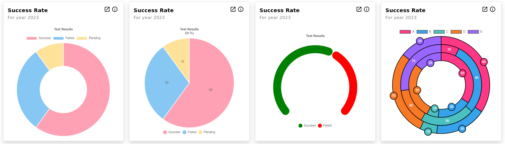
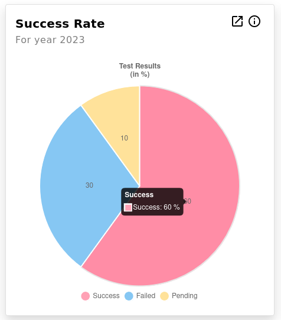

## Doughnut/Pie Chart Widget



| Option Name    | Description                                                                                                                                | Structure | Default                     |
| -------------- | ------------------------------------------------------------------------------------------------------------------------------------------ | --------- | --------------------------- |
| title          | General widget title (not chart title)                                                                                                     | String    | null                        |
| subtitle       | Widget subtitle, added below the title for additional information.                                                                         | String    | null                        |
| info           | If given, will be shown on hover over Info icon.<br /><br />Supports HTML content.<br />                                                   | String    | null                        |
| url            | If given, an icon will be shown, which when clicked will open the given URL in a new tab                                                   | String    | null                        |
| datasets       | [See ChartJS Docs](https://www.chartjs.org/docs/3.9.1/general/data-structures.html).                                                       | Object[]  | []                          |
| labels         | [See ChartJS Docs](https://www.chartjs.org/docs/3.9.1/general/data-structures.html).                                                       | String[]  | []                          |
| chartOptions   | Provide additional[Chart.js Options](https://www.chartjs.org/docs/3.9.1/charts/line.html#dataset-properties) to doughnut-chart             | Object    | [See Below](#chart-options) |
| hideLegend     | Will hide the legend if True                                                                                                               | Bool      | false                       |
| dataPresent    | Will hide the chart if False                                                                                                               | Bool      | true                        |
| dataAbsentText | Text to show when dataPresent is False                                                                                                     | String    | `Data Unavailable`          |
| chartStyle     | Extra styles that will be passed for the chart styles. (Use[ngStyle](https://angular.io/api/common/NgStyle#description) compatible object) | Object    | {}                          |

### Included Plugins

| Plugin Name | Configuration                                                            | Key in chartOptions.plugins |
| ----------- | ------------------------------------------------------------------------ | --------------------------- |
| Data Label  | [See Docs](https://v2_2_0--chartjs-plugin-datalabels.netlify.app/guide/) | datalabels                  |

### Included Adapter

| Plugin Name        | Configuration                                                              |
| ------------------ | -------------------------------------------------------------------------- |
| Luxon Date Adapter | [See Docs](https://github.com/chartjs/chartjs-adapter-luxon#configuration) |

### Chart Options

```ts
      {
        maintainAspectRatio: false,
        animation: {
          duration: 1500,
        },
        cutout: '50%',
        plugins: {
          datalabels: {
            display: false,
            clamp: true,
            formatter: (value, ctx) => {
              let label = value;
              if (isObject(value)) {
                label = get(value, 'label', JSON.stringify(value));
              }
              return `${label}`;
            },
          }
        }
      }
```

Any options given through `chartOptions` will be added in case not configured or will override in case already configured in default options.
Rest of the default options will not be lost.

### Callbacks Support

As functions can be passed into JSON, the various callback functions can also be passed here as object.

Each callback function in chart options can be passed as an object with the following properties:

```
{
    "arguments" : String,
    "body" : String,
}
```

See examples below.

---

### Examples:

#### Example 1 : Doughnut Chart

##### JSON Input:

```js
        {
          widget: "doughnut-pie-chart",
          classes: ["col-md-6", "col-lg-3"],
          title: "Success Rate",
          subtitle: "For year 2023",
          url: "www.google.com",
          info: "<strong>Success Rate</strong>  in current year",
          datasets: [
            {
              data: [60, 30, 10],
            },
          ],
          labels: ["Success", "Failed", "Pending"],
          chartOptions: {
            plugins: {
              title: {
                display: true,
                text: "Test Results",
              },
            },
          },
        }
```

##### Widget Output


#### Example 2

##### JSON Input:

```js
        {
          widget: "doughnut-pie-chart",
          classes: ["col-md-6", "col-lg-3"],
          title: "Success Rate",
          subtitle: "For year 2023",
          url: "www.google.com",
          info: "<strong>Success Rate</strong>  in current year",
          datasets: [
            {
              data: [60, 30, 10],
            },
          ],
          labels: ["Success", "Failed", "Pending"],
          chartOptions: {
            cutout: 0,
            plugins: {
              title: {
                display: true,
                text: ["Test Results", "(in %)"],
              },
              datalabels: {
                display: "auto",
              },
              legend: {
                position: "bottom",
                labels: {
                  usePointStyle: true,
                },
              },
              tooltip: {
                callbacks: {
                  label: {
                    arguments: "tooltipItem",
                    body: "return tooltipItem.label + ': ' + tooltipItem.formattedValue + ' %';",
                  },
                },
              },
            },
          },
        }
```

##### Widget Output



---

[Go Back to Main Page](../README.md)
