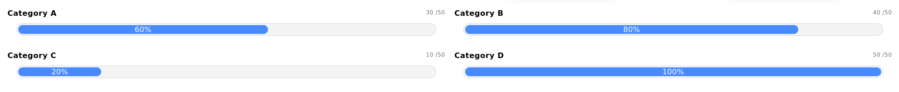

## Bar Chart Widget




| Option Name              | Description                                                                                                                                                                                       | Structure | Default                              |
| -------------------------- | --------------------------------------------------------------------------------------------------------------------------------------------------------------------------------------------------- | ----------- | -------------------------------------- |
| datasets                 | This will be an array of objects.                                                                                                                                                                 | Object[]  | []                                   |
| datasets[index].title    | Progress chart title                                                                                                                                                                              | String    | null                                 |
| datasets[index].classes  | Progress chart bootstrap grid classes.<br />Eg.`col-md-6` will allocate half of total widget width for this progress chart for medium size screen and above                                       | String[]  | []                                   |
| datasets[index].max      | Max value for progress bar                                                                                                                                                                        | Number    | 100                                  |
| datasets[index].value    | The achieved value for progress bar                                                                                                                                                               | Number    | 0                                    |
| datasets[index].progress | The progress percentage for progress bar.<br />Note: If progress is provided, max and value will not be used to calculate progress percentage. Skip this value if providing max and value.        | Number    | Calculated based on`max` and `value` |
| color                    | Color of progress bar.                                                                                                                                                                            | String    | `#488aff`                            |
| disablePercentage        | If True, will not show percentage symbol in the progress bar                                                                                                                                      | Bool      | False                                |
| clickable                | If True, the progress bar and title will be clickable. An output event will be emitted when clicked.<br />Event Structure:<br />*{"action":"clicked","widget":"progress-chart","data":`dataset`}* | Bool      | False                                |

### Examples:

#### Example 1

##### JSON Input:

```js
        {
          widget: "progress-chart",
          classes: ["col-12"],
          clickable: true,
          datasets: [
            {
              title: "Category A",
              classes: ["col-md-6"],
              max: 50,
              value: 30,
              customId: 1,
            },
            {
              title: "Category B",
              classes: ["col-md-6"],
              max: 50,
              value: 40,
              customId: 1,
            },
            {
              title: "Category C",
              classes: ["col-md-6"],
              max: 50,
              value: 10,
              customId: 1,
            },
            {
              title: "Category D",
              classes: ["col-md-6"],
              max: 50,
              value: 50,
              customId: 1,
            },
          ],
        }
```

##### Widget Output


---

[Go Back to Main Page](../README.md)
