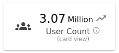

## Small Stat Widget


| Option Name             | Description                                                                                                                       | Structure               | Default |
| :---------------------- | --------------------------------------------------------------------------------------------------------------------------------- | ----------------------- | ------- |
| title                   | General widget title                                                                                                              | String                  | null    |
| subtitle                | Widget subtitle, added below the title for additional information.                                                                | String                  | null    |
| info                    | If given, will be shown on hover over Info icon.<br /><br />Supports HTML content.<br />                                          | String                  | null    |
| icon                    | Takes Material Icon name. If given, will be shown on left hand side of the widget.                                                | String                  | null    |
| trend                   | If given, icon will be shown on beside the stat for trend visualization.                                                          | "up"\| "down" \| "flat" | null    |
| value                   | The main value to be shown in widget.                                                                                             | String                  | null    |
| showSeparateUnit        | If true, will auto calculate/split unit from the value and show it.                                                               | Bool                    | false   |
| unit                    | If provided, will show the unit for the stat.<br />Note: It will be auto calculated from the value if `showSeparateUnit` is true. | String                  | null    |
| displayAsIndividualCard | If True, the widget will be shown as a card                                                                                       | Bool                    | false   |

### Examples:

##### JSON Input:

```js
{
    widget: "small-stat",
    classes: ["col-md-6", "col-lg-3"],
    title: "User Count",
    subtitle: "(card view)",
    value: "3.07 Million",
    showSeparateUnit: true,
    displayAsIndividualCard: true,
    trend: "up",
    info: "abc",
    icon: "groups",
}

```

##### Widget Output



---

[Go Back to Main Page](../README.md)
