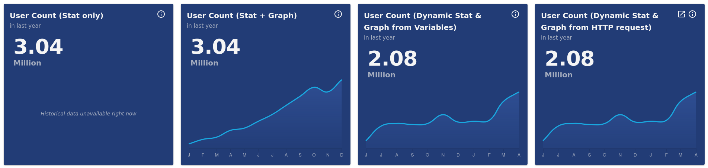
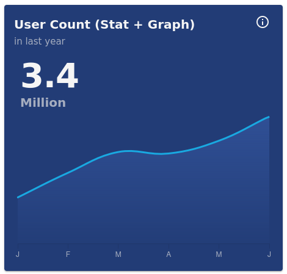

## Stat Graph Card Widget



| Option Name           | Description                                                                                                                                                                                            | Structure | Default                       |
| --------------------- | ------------------------------------------------------------------------------------------------------------------------------------------------------------------------------------------------------ | --------- | ----------------------------- |
| title                 | General widget title (not chart title)                                                                                                                                                                 | String    | null                          |
| info                  | If given, will be shown on hover over Info icon.<br /><br />Supports HTML content.<br />                                                                                                               | String    | null                          |
| datasets              | [See ChartJS Docs](https://www.chartjs.org/docs/3.9.1/general/data-structures.html). The `backgroundColor` of each dataset supports Gradient (See [details](#gradient-background-color-support) below) | Object[]  | []                            |
| labels                | [See ChartJS Docs](https://www.chartjs.org/docs/3.9.1/general/data-structures.html).                                                                                                                   | String[]  | []                            |
| chartOptions          | Provide additional[Chart.js Options](https://www.chartjs.org/docs/3.9.1/charts/line.html#dataset-properties) to line-chart                                                                             | Object    | [See Below](#chart-options)   |
| dataPresent           | Will hide the chart if False                                                                                                                                                                           | Bool      | true                          |
| dataAbsentText        | Text to show when dataPresent is False                                                                                                                                                                 | String    | `Historical data unavailable` |
| stat.value            | If provided, will show a value above the chart                                                                                                                                                         | String    | null                          |
| stat.showSeparateUnit | If true, will auto calculate/split unit from the value and show it.                                                                                                                                    | Bool      | false                         |
| stat.unit             | If provided, will show the unit for the stat.<br />Note: It will be auto calculated from the value if `showSeparateUnit` is true.                                                                      | String    | null                          |
| chartStyle            | Extra styles that will be passed for the chart styles. (Use[ngStyle](https://angular.io/api/common/NgStyle#description) compatible object)                                                             | Object    | {}                            |

### Included Plugins

| Plugin Name | Configuration                                                            | Key in chartOptions.plugins |
| ----------- | ------------------------------------------------------------------------ | --------------------------- |
| Data Label  | [See Docs](https://v2_2_0--chartjs-plugin-datalabels.netlify.app/guide/) | datalabels                  |

### Included Adapter

| Plugin Name        | Configuration                                                              |
| ------------------ | -------------------------------------------------------------------------- |
| Luxon Date Adapter | [See Docs](https://github.com/chartjs/chartjs-adapter-luxon#configuration) |

### Chart Options

```js
{
    maintainAspectRatio: false,
    animation: {
        duration: 1500,
    },
    plugins:
    {
        datalabels: {
            display: false,
        },
        tooltip: {
            mode: 'index',
            intersect: false,
            position: 'average',
            titleAlign: 'center',
        },
    },
    scales: {
        x:
        {
            grid: {
                drawOnChartArea: false,
            },
            ticks: {
                color: '#e0e0e0b0',
                callback: function (value) {
                    return this.getLabelForValue(Number(value)).charAt(0);
                },
            },
        },
        y:
        {
            display: false,
            beginAtZero: true,
        },
    },
    datasets: {
        line: {
            pointRadius: 0,
            pointHitRadius: 15,
            fill: true,
        },
    },
}
```

Any options given through `chartOptions` will be added in case not configured or will override in case already configured in default options.
Rest of the default options will not be lost.

### Gradient Background Color Support

If `datasets[index].backgroundColor` is a string in format :
`Color1-Color2-Color3...-ColorN` (Color strings separated by hyphen `-`),
Then the color string will be converted to Gradients.

Example: `#8626c366-#8626c305`

### Colors for datasets used

```js
[
  {
    data: [],
    backgroundColor: "#305096-#30509615",
    borderColor: "#19a9e1",
    pointBackgroundColor: "rgb(80,147,248)",
    tension: 0.4,
  },
];
```

### Callbacks Support

As functions can be passed into JSON, the various callback functions can also be passed here as object.

Each callback function in chart options can be passed as an object with the following properties:

```
{
    "arguments" : String,
    "body" : String,
}
```

See examples below.

---

### Examples:

##### JSON Input:

```js
{
    widget: "stat-graph-card",
    classes: ["col-md-6", "col-lg-3"],
    title: "User Count (Stat + Graph)",
    subtitle: "in last year",
    info: "<strong>Active User Count</strong>  in last year",
    stat: {
        value: "3.4 Million",
        showSeparateUnit: true,
    },
    datasets: [
        {
            data: [
                {
                    month: "Jan",
                    value: 1.23,
                },
                {
                    month: "Feb",
                    value: 1.89,
                },
                {
                    month: "Mar",
                    value: 2.45,
                },
                {
                    month: "Apr",
                    value: 2.41,
                },
                {
                    month: "May",
                    value: 2.75,
                },
                {
                    month: "Jun",
                    value: 3.4,
                },
            ],
            label: "User Count (in M)",
            parsing: {
                xAxisKey: "month",
                yAxisKey: "value",
            },
        },
    ],
    chartStyle: {
        "height.px": 250
    }
}

```

##### Widget Output



---

[Go Back to Main Page](../README.md)
